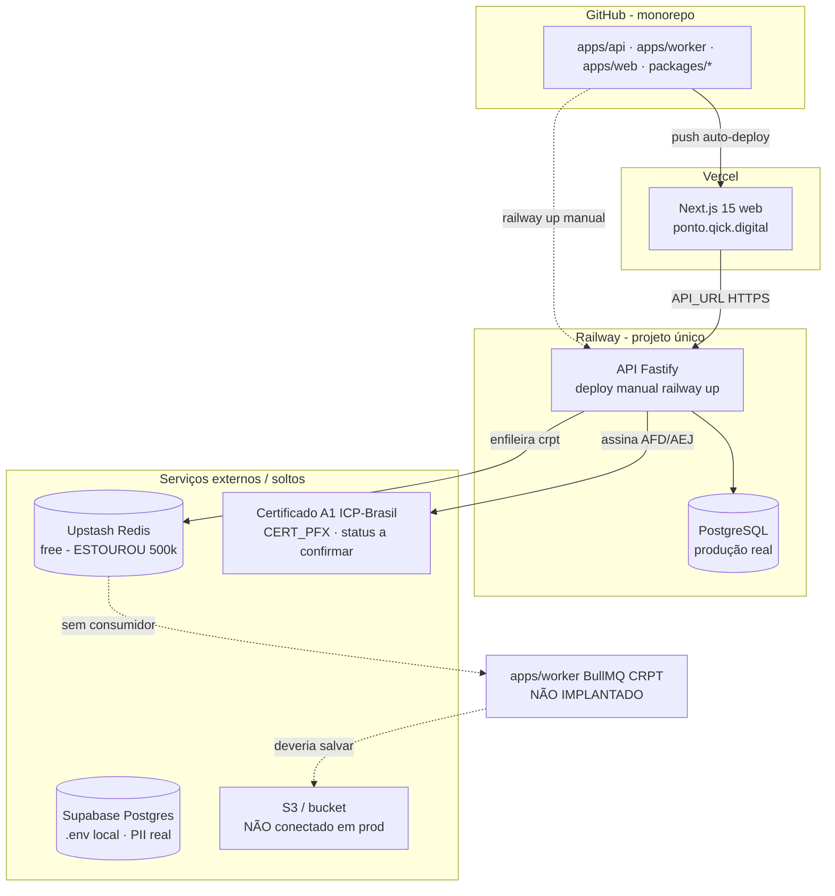
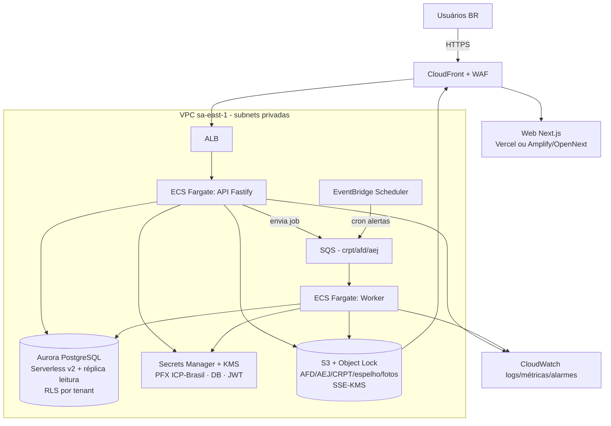

# Qick Ponto — Avaliação Técnica de Arquitetura (pré-lançamento)

> Documento técnico para o time de tecnologia, com resumos executivos para leitura não-técnica.
> Levantado em 2026-06-24 a partir do código-fonte e do estado real de produção.
> **Natureza:** diagnóstico + recomendação. Nada foi alterado no sistema.
>
> **Como ler:** a **Parte A** é o retrato fiel e crítico do que existe. A **Parte B** é a
> recomendação opinativa de arquitetura-alvo em AWS — cada item da Parte B resolve um problema
> concreto apontado na Parte A (as referências cruzadas estão marcadas como `→ resolve A2.x`).

---

## Sumário para o fundador (1 minuto)

O **produto** (regras de ponto, apuração, fiscal) está bem construído e modular. O que **não**
está pronto para um lançamento oficial é a **infraestrutura ao redor** e alguns **controles de
segurança**. Em ordem de gravidade: (1) o gerador de comprovantes fiscais não está ligado em
produção; (2) os arquivos (comprovantes, fotos, arquivos fiscais) não estão sendo guardados de
forma durável; (3) faltam proteções básicas (limite de tentativas de login, isolamento reforçado
entre clientes no banco) e a chave do certificado digital fica desprotegida em memória.

Nada disso é reescrita de produto — é **organização de infraestrutura e endurecimento de
segurança**. A recomendação é levar para **AWS em São Paulo (sa-east-1)** numa arquitetura de
contêineres (Fargate) + banco gerenciado (Aurora) + S3, com a chave do certificado no **Secrets
Manager**. Custo estimado: **ordem de US$ 300–500/mês** no cenário atual (~600 colaboradores) e
**US$ 1.000–2.000/mês** com 20 clientes.

---

# PARTE A — DIAGNÓSTICO DA ARQUITETURA ATUAL

## A1. Arquitetura atual (retrato fiel)

### A1.1 Stack

| Camada | Tecnologia | Observação |
|--------|-----------|------------|
| Linguagem/runtime | Node.js 22 + TypeScript 5 (strict) | Bem configurado, sem `any` |
| API | Fastify 5 + `@fastify/jwt` + `@fastify/multipart` | Monólito modular (M1–M12 + HE) |
| Validação | Zod (domínio) + JSON Schema (transporte) | Boa disciplina |
| ORM | Prisma 6 | Migrations versionadas |
| Banco | PostgreSQL 16 | Em produção: Postgres do Railway |
| Fila/cache | BullMQ 5 + Redis (Upstash) | **Worker não implantado; Redis estourou** |
| Storage | S3-compatível (MinIO local) | **Não conectado em produção** |
| PDF | pdfkit + node-signpdf (CRPT PAdES) | Geração ok; persistência não |
| Assinatura fiscal | node-forge (CAdES p/ AFD/AEJ) | Síncrona na API |
| Web | Next.js 15 (App Router) | Vercel, OK |
| Testes | Vitest | **Só 3 arquivos de teste** |
| Monorepo | pnpm workspaces | `apps/{api,worker,web}` + `packages/{db,afd,pdf,types}` |

### A1.2 Topologia atual (mermaid)

### A1.3 Onde os dados ficam / autenticação / arquivos

- **Dados estruturados:** PostgreSQL (Railway em prod). Multi-tenant **row-level** com coluna
  `tenant_id` em todas as tabelas. PII em `Colaborador` (CPF, PIS/NIT, matrícula); marcações em
  `Marcacao` (NSR, hash SHA-256, `imagem_ref`, `latitude`/`longitude`).
- **Autenticação:** login próprio (`/v1/auth/login`) — senha com **scrypt + salt** e
  `timingSafeEqual` (bom). Emite **JWT** (`@fastify/jwt`) com payload `{ sub, tenantId, role, cnpj }`.
  Plugins `authPlugin` (verifica JWT) e `tenantPlugin` (injeta `tenantId`). RBAC por `requireRole`.
- **Arquivos (comprovante CRPT, AFD/AEJ, fotos de marcação):** **PROBLEMA.** O schema referencia
  imagens em S3 (`imagem_ref`) e o worker monta uma URL `s3://…`, mas **nenhum upload real
  acontece** — o PDF do comprovante é gerado em memória e descartado
  (`apps/worker/src/index.ts`), e o espelho (M6) retorna um Buffer com o comentário explícito
  "upload para S3 é responsabilidade do caller" — e ninguém é o caller. Ou seja: **os artefatos
  fiscais e as fotos não estão sendo persistidos de forma durável em produção.**

### A1.4 Assinatura digital ICP-Brasil hoje

- **AFD/AEJ:** assinatura **CAdES detached** via `node-forge` (`packages/afd/src/assinatura.ts`),
  feita **de forma síncrona dentro da API** no momento da geração (`m7-afd`).
- **CRPT (comprovante):** assinatura **PAdES** via node-signpdf, prevista no worker (que não roda).
- **Chave privada:** o PFX (PKCS#12) é decodificado com node-forge e a **chave privada é
  descriptografada em memória de aplicação** a cada assinatura (`pkcs12FromAsn1` + extração do
  `pkcs8ShroudedKeyBag`). A chave vem de `CERT_PFX_*` (env). → ver risco em **A2.4**.

---

## A2. Segurança (crítico — dado trabalhista + biometria + LGPD)

### A2.1 Autenticação
- ✅ scrypt + salt + comparação em tempo constante: implementação sólida.
- ⚠️ **Sem limite de tentativas (rate limiting).** `@fastify/rate-limit` está nas dependências mas
  **não é registrado** no `server.ts` → **login exposto a força bruta / credential stuffing**.
- ⚠️ **JWT sem refresh/rotação aparente** e `JWT_SECRET` com default `change-me-in-production` no
  `.env.example` — confirmar que o valor em produção é forte e único. Sem rotação de segredo.
- ⚠️ Sem MFA (aceitável para colaborador; **recomendado para Admin/RH**).

### A2.2 Autorização por perfil
- ✅ RBAC explícito (`ADMIN_TENANT`, `RH_DP`, `GESTOR`, `COLABORADOR`, `AUDITOR`) via `requireRole`.
- ⚠️ Autorização **a nível de rota**, não a nível de **dado**. Ex.: o gestor é limitado aos
  "colaboradores visíveis", mas isso é lógica de aplicação — ver A2.3.

### A2.3 Isolamento multi-tenant (o ponto mais sensível)
- ⚠️⚠️ **O isolamento por `tenant_id` é por convenção, manual em cada query.** **Não há** Prisma
  middleware (`$use`/`$extends`) nem **Row-Level Security (RLS)** no Postgres forçando o filtro.
  A garantia "nenhuma query roda sem `tenant_id`" depende de o desenvolvedor lembrar em **toda**
  query. **Uma query esquecida = vazamento de dado entre clientes** (um call center vendo ponto
  de outro). Para dado trabalhista isso é risco grave (LGPD + contratual).
- **Recomendação:** defesa em profundidade — **RLS no Postgres** por `tenant_id` (o banco recusa
  o cross-tenant mesmo se a aplicação errar) e/ou Prisma client estendido que injeta o filtro.

### A2.4 Criptografia
- **Em trânsito:** HTTPS no Vercel e no Railway (TLS gerenciado). ✅
- **Em repouso:** Postgres do Railway e Supabase são gerenciados com criptografia em repouso por
  padrão. ✅ **Porém** não há **criptografia em nível de campo** para PII especialmente sensível
  (CPF, PIS, e principalmente **fotos/biometria**) — fica na confiança do storage.
- ⚠️ **Fotos de marcação = dado biométrico/sensível (LGPD art. 11).** Hoje: referenciadas em
  `imagem_ref` mas **não persistidas**; quando forem, precisam de bucket privado, **SSE-KMS**,
  URLs pré-assinadas de curta duração, e política de retenção/minimização.

### A2.5 Gestão de segredos
- ⚠️ Segredos hoje vivem em **variáveis de ambiente** (Railway/Vercel) e no `.env` local. Não há
  cofre dedicado (Secrets Manager) nem rotação.
- ⚠️ **Chave privada ICP-Brasil da Qick.ai = ponto único de falha e maior ativo de risco:**
  - É **uma única chave A1 da Qick.ai** que assina por **todos os tenants** (modelo de PSC/REP-P).
    Comprometimento → invalida a integridade fiscal de **todos** os clientes.
  - Fica **descriptografada em memória** do processo a cada assinatura (A1.4). Um dump de memória
    / RCE expõe a chave.
  - Hoje entregue por env var — **risco de vazar em logs, em imagem de contêiner, ou no upload do
    `railway up`** (que já enviou o diretório inteiro sem `.gitignore` no passado).
- ✅ Há boa intenção no `.env.example` ("usar AWS Secrets Manager em produção") — não implementado.

### A2.6 Vulnerabilidades conhecidas a endurecer antes de produção
1. **Sem rate limiting** (registrar `@fastify/rate-limit`, especialmente no login).
2. **Sem RLS / isolamento forçado de tenant** (risco de vazamento cross-tenant).
3. **Chave ICP-Brasil em env + memória** (mover para cofre; avaliar assinatura isolada — ver B2).
4. **Sem cabeçalhos de segurança** (`@fastify/helmet` ausente) e **CORS não configurado**
   (hoje o front chama a API server-to-server, então CORS não é exposto ao browser — vira problema
   no dia de um app mobile ou SPA que chame a API direto).
5. **`JWT_SECRET`/credenciais** possivelmente fracos/defaults — confirmar e rotacionar.
6. **Supabase ficou com RLS desligado e PII real exposta** (corrigido nesta semana ligando RLS,
   mas o banco-fantasma deve ser aposentado e as senhas expostas rotacionadas).
7. **Fotos/biometria sem proteção específica de dado sensível** (quando o storage for ligado).
8. **Ausência de WAF / proteção de borda** contra abuso.

---

## A3. Escalabilidade

### A3.1 Capacidade atual (estimativa)
- O sistema é um **monólito modular** num único processo de API + um worker (não implantado).
- Com **1 tenant (~600 colaboradores)** a carga é baixa: ~2.000–5.000 marcações/dia, **concentradas
  nos limites de turno** (entrada/saída/intervalo). Pico real é por minuto, não por dia.
- Hoje **aguenta** o piloto — mas com margem de segurança desconhecida (sem teste de carga).

### A3.2 Gargalos quando crescer
- **Pico de marcação no início do turno:** a alocação de **NSR é atômica e serializada por CNPJ**
  (`UPDATE … nsr_contador = nsr_contador + 1 … RETURNING`, dentro de transação — **correto** para
  integridade). Mas é um **hotspot de linha única por CNPJ**: muitas batidas simultâneas do mesmo
  CNPJ **serializam** nesse contador → latência cresce no pico. Em 20 call centers grandes
  batendo 08:00 em ponto, esse é o primeiro ponto de contenção.
- **Geração de AFD de milhares de registros:** hoje é **síncrona dentro da API** (`m7-afd`). Um AFD
  de um período grande **bloqueia um worker HTTP** e pode estourar timeout/memória. Não escala.
- **Assinatura em massa de comprovantes:** depende do worker (não implantado) + Redis (estourado).
  Mesmo corrigido, a assinatura é CPU-intensiva (criptografia) → precisa de paralelismo controlado.
- **Relatórios/apuração:** queries de agregação em `JornadaApurada`/`Marcacao` por período. Há
  **índices compostos razoáveis** (`@@index([tenant_id, colaborador_id, timestamp_marcacao])`,
  `@@index([tenant_id, status])`), mas relatórios cross-período em 20 clientes vão competir com a
  carga transacional no **mesmo banco** (sem réplica de leitura).

### A3.3 O que quebra primeiro de 1 → 20 clientes
1. **Redis/worker** (já quebrado hoje) — sem isso, nada de CRPT.
2. **Banco único sem réplica** — relatórios pesados + pico de escrita competindo.
3. **API síncrona para AFD** — geração longa derruba a experiência.
4. **Isolamento de tenant manual** — quanto mais clientes, maior a chance de uma query vazar.
5. **Deploy manual da API** — operacionalmente insustentável com SLA.

---

## A4. Performance
- **Pontos lentos previsíveis:** geração de AFD/AEJ síncrona; assinatura criptográfica; relatórios
  de período longo; o hotspot de NSR no pico.
- **Estratégia de banco:** índices compostos presentes nas tabelas quentes (`Marcacao`,
  `JornadaApurada`, `Ajuste`, `SolicitacaoCompensacao`). Faltam: **réplica de leitura** para
  relatórios; análise de planos (EXPLAIN) sob carga; possível particionamento futuro de `Marcacao`
  por período (tabela que só cresce e é imutável → candidata a particionar por mês).
- **Síncrono vs assíncrono:** marcação dispara CRPT **assíncrono** (correto, via fila) — mas o
  consumidor não existe. **AFD e fechamento são síncronos** — deveriam ser **jobs assíncronos**
  com notificação ao final (o usuário pede, recebe quando ficar pronto).

---

## A5. Hospedagem atual e de-para para AWS

### A5.1 Hospedagem atual e por quê
- **Railway (API + Postgres) + Vercel (web) + Upstash (Redis) + Supabase (resíduo).** Escolha por
  **simplicidade de desenvolvimento e velocidade de piloto** — deploy fácil, sem ops. Decisão
  correta para validar o produto. **Não** foi pensada para produção regulada/escala.

### A5.2 De-para (atual → AWS)

| Componente atual | AWS equivalente | Trade-off / quando usar |
|---|---|---|
| API Fastify (Railway) | **ECS Fargate** (contêiner) | Sem servidor pra gerenciar, escala horizontal. *Alt:* EC2 (mais ops), Lambda (refatorar; ruim p/ AFD longo). |
| Worker BullMQ | **ECS Fargate** (serviço separado) consumindo **SQS** | Desacopla; escala por fila. *Alt:* manter BullMQ em ElastiCache. |
| PostgreSQL | **Aurora PostgreSQL Serverless v2** | Escala com pico, réplica de leitura fácil. *Alt:* **RDS Postgres Multi-AZ** (mais barato no início, menos elástico). |
| Redis (Upstash) | **SQS** (e remover Redis) | Fila gerenciada, barata. *Alt:* **ElastiCache Redis** se quiser manter BullMQ. |
| Storage S3 (MinIO) | **S3** (+ Object Lock p/ fiscal) | Nativo. WORM/retenção legal de AFD. |
| CDN/entrega de arquivos | **CloudFront** | Servir fotos/PDF com URL assinada. |
| Segredos/credenciais | **Secrets Manager** + **KMS** | Cofre + rotação. |
| **Chave ICP-Brasil A1** | **Secrets Manager (cripto KMS)** | Ver KMS vs CloudHSM em A5.3. |
| Autenticação | **Manter JWT próprio** | Cognito agregaria pouco e custaria migração — ver B3. |
| Cron (alertas) | **EventBridge Scheduler** | Dispara jobs agendados. |
| Web (Next.js) | **Manter Vercel** ou **Amplify/OpenNext** | Vercel tem melhor DX; AWS se exigir cloud único. |
| Observabilidade | **CloudWatch** (+ X-Ray) | Logs, métricas, alarmes. |
| Borda/segurança | **WAF + ALB** | Proteção e TLS. |

### A5.3 Chave privada ICP-Brasil: KMS vs CloudHSM
- O certificado é um **A1 (software, PKCS#12, validade ~1 ano)** — por definição a chave é um
  arquivo. O modelo legal do A1 **não exige HSM**.
- **CloudHSM:** FIPS 140-2 nível 3, isolamento total da chave. **Custo ~US$ 1.000–1.200/mês por
  HSM** (e 2 para HA ≈ US$ 2.200/mês). **Desproporcional para um A1.** Faz sentido só para A3/A4
  ou exigência específica de não-exposição absoluta.
- **KMS:** pode guardar/usar chave RSA assimétrica e assinar via API (a chave nunca sai do KMS),
  **mas** as libs atuais (node-forge, node-signpdf) esperam a chave **local** — usar KMS exige
  **refatorar a assinatura** para delegar o "sign do digest" ao KMS.
- **Recomendação (defendida em B2):** **Secrets Manager guardando o PFX, envelopado por KMS**, e
  assinatura na aplicação. Proporcional ao A1, baixo custo, sem refatoração. **KMS-Sign (chave
  importada)** fica como **endurecimento futuro** se compliance exigir que a chave nunca esteja em
  memória. CloudHSM: descartado pelo custo/benefício.

### A5.4 Soberania de dados (sa-east-1)
- Dado trabalhista + biométrico de brasileiros. A LGPD **não exige** residência no país, mas manter
  em **sa-east-1 (São Paulo)** evita transferência internacional, simplifica a postura de
  compliance e **reduz latência** para usuários BR.
- **Custo:** sa-east-1 é ~15–30% mais cara que us-east-1 e alguns serviços novos chegam depois.
  **Veredito:** para este produto, **sa-east-1 é a escolha certa** (compliance + latência > custo).

### A5.5 Ordem de grandeza de custo em AWS (ver detalhamento em B5)
- **Atual (~600 colaboradores, 1 cliente):** ~**US$ 300–500/mês**.
- **20 clientes (~12k colaboradores):** ~**US$ 1.000–2.000/mês**.
- Drivers fixos: NAT Gateway, ALB, Multi-AZ. Driver que escala: banco e (pouco) S3/transfer.

### A5.6 Esforço de migração (honesto)
- **Troca simples (config/infra, sem mexer no produto):** Postgres → RDS/Aurora (dump/restore);
  storage → S3 (o código já fala "S3-compatível"); segredos → Secrets Manager; deploy → Fargate
  (app já roda em contêiner). **Dias, não semanas.**
- **Exige código:**
  - Implementar **upload real** de CRPT/espelho/AFD/fotos (hoje não existe).
  - **Worker → SQS** (trocar produtor/consumidor BullMQ por SDK SQS) — ou manter BullMQ e só
    implantar o worker.
  - **AFD/fechamento síncrono → assíncrono** (job + notificação).
  - **RLS / isolamento de tenant** e **rate limiting** (endurecimento).
  - (Opcional) **KMS-Sign** para a chave.

---

## A6. Manutenibilidade e evolução
- ✅ **Boa separação** por módulos de negócio (`router`/`service`/`repository`/`schema`), TS strict,
  Zod, Prisma. Adicionar um **novo conector de folha** (além do PSLZ/Questor) ou **novo relatório**
  é localizado e de baixo atrito. A base está **organizada para um time avançado assumir**.
- ⚠️ **Dívida técnica relevante:**
  - **Cobertura de testes baixíssima (3 arquivos):** só `afd/generator`, `m4 calcular-dia`,
    `m3 nr17`. Núcleo fiscal/jurídico **sem rede de segurança** — arriscado para mudar com
    confiança. Antes de evoluir muito, subir cobertura nas regras críticas (apuração, NSR,
    AFD/AEJ, isolamento de tenant).
  - **Isolamento de tenant por convenção** (A2.3) — dívida de segurança.
  - **Storage/worker stub** (A1.3) — funcionalidade incompleta marcada como pronta.
  - **Sem IaC** (infra é clicada no Railway/Vercel) — dificulta reproduzir ambientes.
  - **Sem CI** com testes/lint/typecheck obrigatórios no merge.
- **App mobile:** a API REST versionada (`/v1`) facilita; faltaria CORS/segurança de borda e,
  idealmente, refresh tokens.

---

## A7. Roadmap de produção (priorizado)

### 🔴 OBRIGATÓRIO antes do go-live (bloqueadores)
| Item | Risco se ignorar |
|---|---|
| Implantar worker + **upload real** de CRPT | Comprovante fiscal (Portaria 671) não existe → autuação |
| **Storage durável** (S3) p/ AFD/AEJ/fotos/espelho | Perda de prova legal; não-conformidade |
| **Redis/SQS** funcional | Fila quebrada → nada assíncrono processa |
| **Certificado em cofre** + assinatura AFD/AEJ testada em prod | Sem assinatura válida = arquivo fiscal inválido |
| **Backup automático + Multi-AZ** do banco | Perda irreversível de ponto (retenção legal) |
| **Isolamento de tenant forçado (RLS)** | Vazamento de dado entre clientes (LGPD + contrato) |
| **Rate limiting no login** | Força bruta / sequestro de conta |
| **Rotacionar segredos** (JWT, senhas expostas, DB) | Acesso indevido |
| **Proteção de fotos/biometria** (SSE-KMS, acesso restrito) | Dado sensível LGPD vazado |

### 🟠 Importante logo após o go-live
- AFD/fechamento **assíncrono**; observabilidade/alarmes; WAF + helmet; CI com testes; aposentar
  Supabase; auto-deploy da API/worker; ambiente de **staging**.

### 🟢 Melhoria futura
- Réplica de leitura p/ relatórios; particionar `Marcacao`; KMS-Sign da chave; IaC (Terraform/CDK);
  DR multi-AZ→multi-região; elevar cobertura de testes ao núcleo todo.

---

# PARTE B — RECOMENDAÇÃO DE ARQUITETURA (opinativa)

## B0. Premissas que estou assumindo
*(corrijam — cada uma muda a recomendação)*

1. **Time:** 2–4 devs avançados, confortáveis com AWS, **sem** SRE dedicado full-time.
   *Se houver SRE/plataforma forte → vale Kubernetes/EKS e IaC pesado desde já; sem isso, Fargate.*
2. **Go-live:** semanas, não meses. **Prioridade é segurança + conformidade**, não escala extrema.
   *Se o prazo fosse longo, eu investiria mais em assíncrono e testes antes de migrar.*
3. **Crescimento:** 1 → ~20 clientes em 12–18 meses (milhares, não milhões, de colaboradores).
   *Se a ambição fosse 100+ clientes/multi-milhão de marcações, repensaria banco (sharding) e
   ingestão (event-driven).*
4. **Uptime:** alto na janela de turnos; **perda de dado é inaceitável** (fiscal). DR razoável,
   não “zero downtime” extremo. *Se exigissem 99.99%/multi-região, custo e complexidade sobem muito.*
5. **Orçamento:** sensível, mas **conformidade não é onde economizar**. Faixa US$ 300–2.000/mês ok.
6. **Cloud único:** desejável padronizar em **AWS**; web pode ficar no Vercel no curto prazo.

## B1. Resumo executivo (para o fundador)

Minha recomendação é levar o backend para a **AWS em São Paulo**, rodando em **contêineres
gerenciados (Fargate)** — sem servidores para administrar — com **banco gerenciado (Aurora
PostgreSQL)** que tem backup e cópia de segurança automáticos, e **S3** para guardar comprovantes,
arquivos fiscais e fotos de forma durável e imutável. A **chave do certificado digital** fica num
cofre (**Secrets Manager**), não mais espalhada em variáveis.

É uma arquitetura **simples para o tamanho do negócio**: poderosa o suficiente para 20 clientes,
sem a complexidade (e o custo) de coisas como Kubernetes ou HSM dedicado, que seriam exagero aqui.
O **esforço** é de poucas semanas, sendo a maior parte **infra (rápida)** e uma parte menor de
**código** (ligar o que hoje está pela metade: salvar arquivos, processar a fila, deixar a geração
de arquivos fiscais em segundo plano).

O **risco** de não fazer é concreto: hoje os comprovantes não são gerados nem guardados, e um erro
de programação poderia, em teoria, deixar um cliente ver dado de outro. São coisas que **precisam**
estar resolvidas antes de colocar gente real e dado sensível no ar — não depois.

## B2. Arquitetura-alvo recomendada (para o time)

**Decisões, com defesa (e critério de desempate):**

- **Compute = ECS Fargate** (API e Worker como serviços separados). **Por quê e não Lambda:** a API
  é um Fastify **long-running** e a geração de AFD pode ser **longa e pesada de memória** — Lambda
  (15 min, cold start, limites) exigiria refatoração e pioraria o AFD. **E não EC2:** Fargate tira
  a gestão de SO/patching. *Desempate Fargate×EKS:* só iria de EKS **se** houvesse SRE e vários
  serviços; aqui é over-engineering. → resolve **A3.3, A7 (deploy manual)**.
- **Banco = Aurora PostgreSQL Serverless v2** (com **réplica de leitura** para relatórios). **Por
  quê e não RDS simples:** a carga é **espicaçada** (picos de turno) e os **relatórios são
  read-heavy** — Aurora escala ACUs no pico e isola leitura na réplica. *Desempate:* **se o
  orçamento apertar no estágio 1 cliente**, comece em **RDS Postgres Multi-AZ** (mais barato) e
  migre para Aurora ao chegar perto de ~5 clientes ou quando relatório competir com escrita.
  **Multi-AZ é inegociável.** → resolve **A3.2, A3.3, A4**.
- **Assíncrono = SQS** (e **remover Redis**). **Por quê e não ElastiCache/BullMQ:** o uso é
  **despacho simples de job** (gerar CRPT, AFD, AEJ, alertas) — SQS é gerenciado, barato, com
  **DLQ** nativa, e elimina um serviço stateful. *Desempate:* mantenha **BullMQ+ElastiCache** só se
  precisar de jobs **repetíveis/atrasados/rate-limited** sofisticados — não é o caso. → resolve
  **A1.2, A2 (Redis estourado), A3.3**.
- **Arquivos = S3 com Object Lock (modo compliance) + SSE-KMS.** Object Lock dá **imutabilidade
  WORM** — perfeito para **AFD/AEJ** (retenção legal). Fotos/biometria em bucket privado, **SSE-KMS**
  e **URLs pré-assinadas** curtas. **CloudFront** serve com baixa latência. → resolve **A1.3, A2.4**.
- **Chave ICP-Brasil = Secrets Manager (envelope KMS)**, assinatura na app. **Defesa:** é um **A1
  (software)** — Secrets Manager + KMS é **proporcional**; **CloudHSM é exagero** (~US$ 2k/mês) e
  KMS-Sign exigiria refatorar a assinatura. **Endurecimento futuro:** migrar para **KMS-Sign**
  (chave nunca em memória) se auditoria exigir. **Nunca** em env var/imagem. → resolve **A2.5, A5.3**.
- **Autenticação = manter o JWT próprio**, endurecido (rate limit, refresh token, rotação de
  segredo, MFA para Admin/RH). **Por quê e não Cognito:** o RBAC e os claims multi-tenant são
  **de domínio**, e migrar usuários/senhas para Cognito traz risco sem ganho real agora. *Desempate:*
  Cognito só se quiserem **login social/MFA gerenciado** como produto. → resolve **A2.1**.
- **CDN = CloudFront** na frente do S3 (e do front, se sair do Vercel). **WAF** na borda (rate
  limiting de borda, regras OWASP). → resolve **A2.6 (4, 8)**.
- **Web:** **manter no Vercel** no curto prazo (DX e já está pronto). Migrar para **Amplify Hosting
  ou OpenNext (Lambda+CloudFront)** **só** se "cloud único" virar requisito duro. → pragmatismo.
- **Observabilidade = CloudWatch** (logs estruturados, métricas, **alarmes**: 5xx, profundidade da
  fila, **DLQ > 0**, CPU/conexamento do banco, falha de assinatura) + **X-Ray** para tracing.
- **Isolamento de tenant = RLS no Postgres** + Prisma estendido injetando `tenant_id`. **Defesa em
  profundidade:** o banco recusa cross-tenant mesmo se a aplicação errar. → resolve **A2.3**.
- **Região = sa-east-1 (São Paulo).** Dado trabalhista/biométrico BR no país. → A5.4.
- **IaC = Terraform ou AWS CDK** desde o início (ambientes reproduzíveis, staging = prod).

## B3. O que eu NÃO faria (anti-recomendações)
- ❌ **Não** colocar a API inteira em **Lambda** "porque é serverless" — Fastify long-running + AFD
  pesado = atrito e refatoração sem ganho.
- ❌ **Não** usar **CloudHSM** para um certificado **A1** — custo desproporcional; Secrets Manager+KMS resolve.
- ❌ **Não** migrar auth para **Cognito** agora — migração de credenciais e RBAC de domínio sem retorno.
- ❌ **Não** subir **EKS/Kubernetes** sem SRE — complexidade operacional que o time vai pagar caro.
- ❌ **Não** quebrar em **microsserviços** — o **monólito modular** é o certo nesta escala; quebrar
  agora multiplica ops e latência de rede sem necessidade.
- ❌ **Não** manter **Redis só por BullMQ** se SQS atende — um serviço stateful a menos.
- ❌ **Não** economizar em **Multi-AZ** do banco nem em **backup** — é dado fiscal/trabalhista.
- ❌ **Não** deixar a **chave privada** em variável de ambiente, imagem de contêiner ou log.
- ❌ **Não** confiar **só** na aplicação para isolar tenants — sem RLS, é uma query distraída de
  distância de um incidente LGPD.
- ❌ **Não** manter o **Supabase** como banco paralelo — aposentar (fonte comprovada de confusão).

## B4. Caminho de migração (faseado, sem parar o dev nem arriscar dados)

- **Fase 0 — Tapar buracos onde já está (dias):** registrar rate-limit; ligar RLS; rotacionar
  segredos; **implantar o worker** e **implementar o upload** (mesmo que ainda no storage atual);
  trocar Redis estourado por um Redis/SQS funcional. *Reduz risco imediato mesmo antes da AWS.*
- **Fase 1 — Fundação AWS (1–2 semanas):** VPC sa-east-1; **Aurora/RDS** + migração de dados
  (`pg_dump`/restore ou **DMS** com replicação para cutover sem downtime); **S3** + Secrets Manager
  (subir o **PFX** para o cofre); **Fargate** (API+worker) atrás de **ALB**; **CloudFront/WAF**.
  Cutover em janela de baixa marcação (madrugada).
- **Fase 2 — Endurecimento (1–2 semanas):** **SQS** + DLQ; **AFD/fechamento assíncrono**; S3 Object
  Lock; SSE-KMS nas fotos; alarmes CloudWatch; CI com testes/lint/typecheck; auto-deploy.
- **Fase 3 — Evolução (contínuo):** réplica de leitura ativa em relatórios; KMS-Sign da chave;
  particionar `Marcacao`; staging; IaC completo; elevar cobertura de testes.

## B5. Custo estimado (ordem de grandeza, sa-east-1, USD/mês)

| Componente | ~600 colab. (1 cliente) | ~12k colab. (20 clientes) |
|---|---|---|
| Fargate (API + worker) | 60–120 | 250–500 |
| Banco (Aurora SLv2 / RDS Multi-AZ) | 80–160 | 350–800 |
| ALB | ~20 | ~25 |
| NAT Gateway (+ dados) | ~35–60 | ~60–120 |
| S3 + CloudFront | 5–20 | 30–120 |
| Secrets Manager + KMS | 5–15 | 10–25 |
| CloudWatch/observabilidade | 10–30 | 40–100 |
| SQS | <5 | 5–20 |
| WAF | ~10 | ~15 |
| **Total aproximado** | **~US$ 300–500** | **~US$ 1.000–2.000** |

- **Fixo (independe de clientes):** ALB, NAT, Multi-AZ base, WAF. **Dica:** usar **VPC endpoints**
  (S3/SQS/Secrets) reduz custo de NAT.
- **Escala com clientes:** principalmente **banco** e, em menor grau, **Fargate** e **S3/transfer**.
- *Não inclui Vercel (web) nem o custo do certificado ICP-Brasil em si.*

## B6. Bloqueadores de go-live (inegociáveis) e o risco concreto

| Bloqueador | Risco concreto de ignorar |
|---|---|
| **Comprovante (CRPT) gerado, assinado e armazenado** | Descumprimento da Portaria 671 → autuação/multa; colaborador sem comprovante |
| **AFD/AEJ assinados e guardados (S3 Object Lock)** | Arquivo fiscal inválido/perdido em fiscalização |
| **Certificado A1 no Secrets Manager** (não em env/memória solta) | Vazamento da chave = comprometimento fiscal de **todos** os clientes |
| **Backup automático + Multi-AZ** do banco | Perda irreversível de jornada (dado de retenção legal) |
| **Isolamento de tenant via RLS** | Um cliente acessar dado de outro → incidente LGPD + quebra de contrato |
| **Rate limiting + segredos rotacionados** | Força bruta, sequestro de conta, acesso indevido |
| **Fotos/biometria com SSE-KMS + acesso restrito** | Vazamento de dado sensível (LGPD art. 11) |
| **TLS fim a fim (ALB/CloudFront)** | Interceptação de credenciais/dados em trânsito |

> **Posição do arquiteto:** o **produto** está pronto; a **operação segura** não. Eu **não
> colocaria dado real de trabalhador no ar** sem os itens de B6 resolvidos. A migração para AWS é o
> momento natural para resolvê-los de uma vez, porque a maioria são capacidades nativas da
> plataforma (S3 Object Lock, Secrets Manager/KMS, Multi-AZ, WAF, RLS) — não código novo complexo.

---

### Apêndice — evidências no código (para o time auditar)
- Auth/scrypt: `apps/api/src/modules/auth/router.ts`.
- Multi-tenant sem RLS/middleware: `apps/api/src/plugins/{auth,tenant}.ts` (sem `$use`/`$extends`).
- Rate-limit não registrado: `apps/api/src/server.ts` (dependência existe, `register` ausente).
- NSR atômico: `apps/api/src/modules/m2-marcacao/nsr.ts` (`UPDATE … RETURNING` em transação).
- Assinatura/chave em memória: `packages/afd/src/assinatura.ts` (node-forge `pkcs12FromAsn1`).
- Worker sem upload: `apps/worker/src/index.ts`. Espelho sem upload: `…/m6-fechamento/service.ts`.
- Índices: `packages/db/prisma/schema.prisma` (`@@index` em `Marcacao`, `JornadaApurada`, etc.).
- Testes: apenas `packages/afd/src/generator.test.ts`, `…/m4-apuracao/engine/calcular-dia.test.ts`,
  `…/m3-pausas/engine/calcular-status-nr17.test.ts`.
